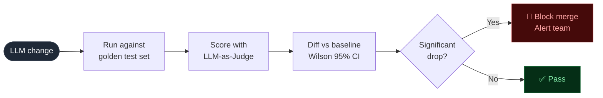
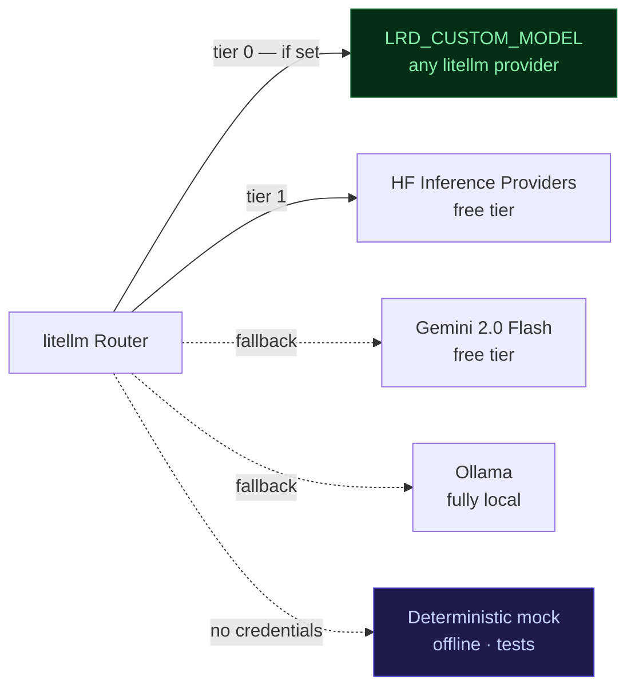

# LLM Regression Detector

> Automated quality gate for LLM systems — catches regressions in CI before they reach users,
> with statistical rigour that won't fire false alarms.

[](https://github.com/adel-saoud/llm-regression-detector/actions/workflows/ci.yml)
[](https://github.com/adel-saoud/llm-regression-detector/actions/workflows/eval.yml)
[](https://www.python.org/)
[](https://github.com/astral-sh/ruff)
[](https://github.com/microsoft/pyright)
[](pyproject.toml)
[](LICENSE)

---

LLM quality can degrade silently — a prompt tweak, a model swap, a fine-tune, or just gradual drift over time. Any of it can break production before anyone notices.

**This project catches those drops automatically.** It runs your LLM system against a labelled test set, diffs accuracy using Wilson 95% confidence intervals, and blocks the merge if the drop is real — not just noise from a small dataset.

> **"Just over half of organizations (52.4%) report running offline evaluations on test sets, indicating that many teams see the importance of catching regressions and validating agent behavior before deployment."**
> — LangChain, [State of Agent Engineering](https://www.langchain.com/state-of-agent-engineering#:~:text=Just%20over%20half%20of%20organization%20(52.4%25)%20report%20running%20offline%20evaluations%20on%20test%20sets)

> Inspired by the eval pipeline I built for DaiLY at Decathlon France — 30,000+ users, rubric pass lifted from ~60% to 97.7% on the lead agent. This is that pattern, open-sourced.


---

## Try it — no API key needed

```bash
git clone https://github.com/adel-saoud/llm-regression-detector
cd llm-regression-detector
uv sync --all-extras

# Step 1 — establish a baseline
uv run lrd run -p prompts/incident_triage_v1.yaml --no-diff --no-notify

# Step 2 — run a degraded candidate and watch it fire
uv run lrd run -p prompts/incident_triage_v2_degraded.yaml --no-notify
```

Expected output:

```
  Accuracy   86.8%  (95% CI 75.2–93.5%)   ← baseline
  p0   100.0%   p1    66.7%   p2    93.3%   p3    90.9%

  Accuracy   56.6%  (95% CI 43.3–69.0%)   ← candidate
  p0    58.3%   p1    33.3%   p2    53.3%   p3    90.9%

CRITICAL · accuracy -30.19 pp significant · regressions=16 · improvements=0
```

The CIs don't overlap → `CRITICAL · significant`. P0 dropped from 100% to 58%, P1 from 67% to 33% — P3 held steady, masking the collapse in the aggregate. That's exactly the failure mode the per-category breakdown is designed to catch.

> Numbers come from the deterministic mock (no key required). Real models produce the same shape; exact values vary — which is why the system reports statistical significance rather than raw deltas.

**With a real model** — get a free token at [huggingface.co/settings/tokens](https://huggingface.co/settings/tokens):

```bash
cp .env.example .env   # set HF_TOKEN=hf_...
uv run lrd run -p prompts/incident_triage_v1.yaml --report evals/report.html
uv run lrd dashboard   # Streamlit UI at localhost:8501
```


## Use it with your own LLM

The incident triage example is a stand-in — the detector works with any LLM task that produces structured output.

**Scaffold a new evaluation in 60 seconds:**

```bash
uv run lrd init
```

The command prompts for a task name and categories, then writes a prompt YAML and a starter golden dataset. Fill in real examples, run `lrd run`, and you're evaluating.

**Or build manually** — see [`docs/golden-dataset-guide.md`](docs/golden-dataset-guide.md) for the full dataset schema and advice on how many cases you need.

---

## How it works

On every pull request:



The included `eval.yml` triggers on changes to `prompts/` or `golden_dataset/` — but `lrd run` is a plain CLI command and can be wired into any CI system or run locally. The diff is computed against the latest stored baseline and the result is posted back as a sticky PR comment.

---

## Why not just compare percentages?

A raw accuracy diff misfires in several common ways. Here's how each is handled:

| Problem | Approach |
|:--|:--|
| **Raw % comparisons are noise on small datasets** | Wilson 95% confidence intervals. If the CIs overlap, the delta is within noise — severity is downgraded automatically. No false alarms. |
| **Aggregate accuracy hides category collapses** | Per-category breakdown in every report. An 80% aggregate can hide a 40-point drop in one category. |
| **Gradual drift is invisible to PR-level diffs** | Slow-drift detector using `MA − k·σ` over recent run history. Catches what one-shot diffs miss. |
| **LLM judge calls are noisy** | Optional majority vote (`LRD_JUDGE_CONSENSUS_N=3`): 3 judge calls per case, winner takes all. Configurable cost/quality tradeoff. |
| **Webhook delivery fails silently** | `tenacity` with exponential backoff + jitter. Every platform (Slack, Discord, Google Chat) uses the same retry policy. |
| **Hard-coded model = vendor lock-in** | `litellm` Router — every model ID lives in `Settings`. Swap providers with one env var, zero code changes. |

---

## Configuration

The project runs at **$0** by default. Set `LRD_CUSTOM_MODEL` to bring your own provider:



`LRD_CUSTOM_MODEL` accepts any [litellm model string](https://docs.litellm.ai/docs/providers) — Anthropic, OpenAI, Vertex AI, GitHub Copilot, and 100+ others. `ollama/` models are auto-detected as local. No credit card required for the default chain.

---

## Project structure

```
src/llm_regression_detector/
├── config.py          Settings — all config is env-driven, never hardcoded
├── llm/               LLM client — litellm Router + deterministic mock
├── eval/              Runner · LLM-as-Judge · Wilson CI · percentiles · drift
├── diff/              Regression detector — CI-aware severity logic
├── notify/            Slack · Google Chat · Discord · generic — shared retry policy
├── storage/           SQLite run history — schema-versioned, forward-migrated
├── report/            HTML report (Jinja2) + GitHub PR comment
├── dashboard/         Streamlit dashboard — KPI cards, accuracy history, version comparison
└── cli.py             lrd run · lrd diff · lrd report · lrd pr-comment · lrd dashboard · lrd init

prompts/               Versioned prompt YAMLs — the "code" being tested
golden_dataset/        53 hand-labelled cases across 4 categories
tests/                 100 tests · 86% coverage · fully hermetic
.github/workflows/     ci.yml (lint, type, test) · eval.yml (eval on PR)
```

Full module map and design decisions → [`docs/architecture.md`](docs/architecture.md)

---

## Tech stack

| | Library / Tool | Role |
|:--|:--|:--|
| **Core** | `litellm` | Provider-agnostic LLM router — one API for 100+ models |
| | `pydantic` v2 + `pydantic-settings` | Runtime-validated models; env-driven config |
| | `typer` + `rich` | CLI with pretty tables and coloured output |
| | `aiosqlite` | Async SQLite run history with schema versioning |
| | `tenacity` + `httpx` | Webhook retry — exponential backoff + jitter |
| | `structlog` | Structured, contextual logging |
| | `jinja2` | HTML report templating |
| **Dashboard** | `streamlit` + `plotly` | Accuracy timeline, CI band, version comparison |
| | `pandas` | Tabular diff and category breakdown |
| **Dev** | `uv` | Fast package manager + lockfile |
| | `ruff` | Lint + format in one tool |
| | `pyright` strict | 0 errors, 0 warnings — full type coverage |
| | `pytest` + `pytest-asyncio` | Hermetic test suite — no network, no keys |
| | `pre-commit` | Enforces lint + format on every commit |

---

## Development

```bash
uv sync --all-extras
uv run pre-commit install

uv run ruff check --fix .    # lint + autofix
uv run ruff format .         # format
uv run pyright               # type-check — must stay at 0 errors
uv run pytest                # 100 tests, 86% coverage, gate at 85%
```

---

## Honest limitations

- **Judge variance is dampened, not eliminated.** Majority vote helps; pairwise judging (comparing versions head-to-head) would be the next tier — not implemented.
- **Binary CI only.** Wilson interval is for pass/fail. A bootstrap CI on the summary score (1–5) would give a tighter signal — not implemented.
- **53 cases catches large regressions.** Subtle drops (≤5 pp) need 200+ cases for CIs to cleanly separate. Documented; not pretending otherwise.
- **No adversarial robustness.** This evaluates classifier quality, not resistance to prompt injection.
- **Free-tier rate limits apply.** The Router retries with backoff, but sustained bursts may need a paid tier.

---

## License

[MIT](LICENSE) — use it, fork it, ship it.
