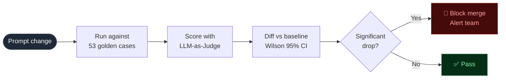
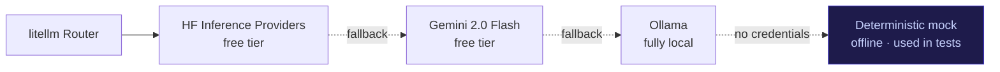
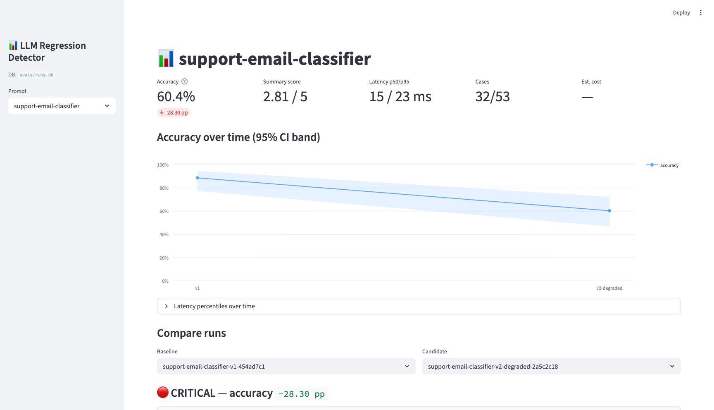

# LLM Regression Detector

> Automated quality gate for LLM prompts — catches regressions in CI before they reach users,
> with statistical rigour that won't fire false alarms.

[](https://github.com/adel-saoud/llm-regression-detector/actions/workflows/ci.yml)
[](https://github.com/adel-saoud/llm-regression-detector/actions/workflows/eval.yml)
[](https://www.python.org/)
[](https://github.com/astral-sh/ruff)
[](https://github.com/microsoft/pyright)
[](pyproject.toml)
[](LICENSE)


<br>

## The problem

> **Only 52% of enterprises run any form of evaluation on their LLM systems.**
> — LangChain, State of AI Agents 2026

When you ship an LLM feature, you're constantly tweaking prompts — adding examples, rephrasing instructions, adjusting tone. Every change *could* silently break quality. Most teams only find out from user complaints.

**This project catches those drops in CI, before they merge.** Think of it as a test suite for your prompts.

> Inspired by the eval pipeline I built for [DaiLY at Decathlon France](#) — 25K users, 98% accuracy in production. This is that pattern, open-sourced.

<br>

## How it works

On every pull request that touches a prompt file:



1. **Run** — the new prompt is sent to all 53 golden cases in parallel
2. **Judge** — an LLM scores each prediction vs the gold label
3. **Diff** — Wilson 95% CIs compare candidate accuracy against the stored baseline
4. **Alert** — severity posted as a PR comment, Slack/Discord message, and HTML report
5. **Gate** — exits non-zero on `CRITICAL`, blocking the merge

<br>

## What makes it non-trivial

A naive accuracy check breaks in three common ways. Here's how this project handles each:

| Problem | Solution |
|:--|:--|
| **Raw % comparisons are unreliable on small datasets** | Wilson 95% confidence intervals — if CIs overlap, it's noise. Severity is automatically downgraded. No false alarms. |
| **Aggregate accuracy hides category-level collapses** | Per-category breakdown in every report. A prompt that scores 80% overall can hide a 42 pp drop in one category. |
| **Gradual drift goes undetected between PR diffs** | Slow-drift detector using a moving-average band (`MA − k·σ`) over recent runs. Catches what single-run diffs miss. |
| **LLM judge is noisy by nature** | Optional majority vote — `LRD_JUDGE_CONSENSUS_N=3` runs 3 judge calls per case, takes the winner. Configurable cost/quality tradeoff. |
| **Webhook delivery fails silently** | `tenacity` with exponential backoff + jitter. Every platform (Slack, Discord, Google Chat) uses the same retry policy. |
| **Hard-coded model = vendor lock-in** | `litellm` Router — every model ID lives in `Settings`. Swap providers with one env var, zero code changes. |

<br>

## Provider fallback chain

The project runs at **$0** by default, with a tiered fallback:



No credit card required anywhere in the default chain.

<br>

## Try it — no API key needed

```bash
git clone https://github.com/adel-saoud/llm-regression-detector
cd llm-regression-detector
uv sync --all-extras
rm -f evals/runs.db

# Step 1 — baseline (88.7% accuracy)
uv run lrd run -p prompts/classifier_v1.yaml --no-diff --no-notify

# Step 2 — degraded candidate (fires CRITICAL)
uv run lrd run -p prompts/classifier_v2_degraded.yaml --no-notify
```

Expected output:

```
  Accuracy   88.7%  (95% CI 77.4–94.7%)   ← baseline

  Accuracy   60.4%  (95% CI 46.9–72.4%)   ← candidate
  billing     57.1%   account    50.0%
  technical   42.9%   general    92.3%

CRITICAL · accuracy -28.30 pp significant · regressions=16 · improvements=1
```

The CIs don't overlap → `CRITICAL · significant`. The per-category breakdown shows billing, account, and technical all collapsed while general masked them in the aggregate.

> Numbers come from the deterministic mock (no key required). Real models produce the same shape; exact values vary — which is exactly why the system reports statistical significance rather than raw deltas.

**With a real model** — get a free token at [huggingface.co/settings/tokens](https://huggingface.co/settings/tokens):

```bash
cp .env.example .env   # then set HF_TOKEN=hf_...
uv run lrd run -p prompts/classifier_v1.yaml --report evals/report.html
uv run lrd dashboard   # Streamlit UI at localhost:8501
```



<br>

## Project structure

```
src/llm_regression_detector/
├── config.py          Settings — all config is env-driven, never hardcoded
├── llm/               LLM client — litellm Router + deterministic mock
├── eval/              Runner · LLM-as-Judge · Wilson CI · percentiles · drift
├── diff/              Regression detector — CI-aware severity logic
├── notify/            Slack · Google Chat · Discord · generic — shared retry policy
├── storage/           SQLite run history — schema-versioned, forward-migrated
├── report/            HTML report (Jinja2) + GitHub PR comment
├── dashboard/         Streamlit dashboard — timeline, CI bands, drift chart
└── cli.py             lrd run · lrd diff · lrd report · lrd dashboard

prompts/               Versioned prompt YAMLs — the "code" being tested
golden_dataset/        53 hand-labelled cases across 4 categories
tests/                 79 tests · 88% coverage · fully hermetic
.github/workflows/     ci.yml — lint, type, test · eval.yml — runs on prompt changes
```

Full module map and architectural decisions → [`docs/architecture.md`](docs/architecture.md)

<br>

## Tech stack

**Core**

| Library | Role |
|:--|:--|
| `litellm` | Provider-agnostic LLM router — one API for 100+ models |
| `pydantic` v2 | Runtime-validated models everywhere; `frozen=True, extra="forbid"` |
| `pydantic-settings` | Env-driven config with validation |
| `typer` + `rich` | CLI with pretty tables and coloured output |
| `aiosqlite` | Async SQLite — run history with schema versioning |
| `tenacity` | Webhook retry with exponential backoff + jitter |
| `structlog` | Structured logs; run-scoped context via `bind()` |
| `jinja2` | HTML report templating |
| `httpx` | Async HTTP for webhook delivery |

**Dashboard**

| Library | Role |
|:--|:--|
| `streamlit` | Dashboard UI |
| `plotly` | Accuracy timeline, CI band charts |
| `pandas` | Data wrangling for the diff tables |

**Dev tooling**

| Tool | Role |
|:--|:--|
| `uv` | Fast package manager + lockfile |
| `ruff` | Lint + format in one tool |
| `pyright` strict | 0 errors, 0 warnings — full type coverage including tests |
| `pytest` + `pytest-asyncio` | Test suite — hermetic, no network, no keys |
| `pre-commit` | Enforces lint + format on every commit |

<br>

## Development

```bash
uv sync --all-extras
uv run pre-commit install

uv run ruff check --fix .    # lint + autofix
uv run ruff format .         # format
uv run pyright               # type-check — must stay at 0 errors
uv run pytest                # 79 tests, 88% coverage, gate at 85%
```

<br>

## Honest limitations

- **Judge variance is dampened, not eliminated.** Majority vote helps; pairwise judging ("is A better than B?") would be the next tier — not implemented.
- **Binary CI only.** Wilson interval is for pass/fail. A paired-bootstrap on the summary score (1–5) would give a tighter signal — not implemented.
- **53 cases catches large regressions.** Subtle drops (≤5 pp) need 200+ cases for CIs to separate cleanly. Documented; not pretending otherwise.
- **No adversarial robustness.** This evaluates classifier quality, not resistance to prompt injection.
- **Free-tier rate limits apply.** The Router retries with backoff, but sustained bursts may need a paid tier.

<br>

## License

[MIT](LICENSE) — use it, fork it, ship it.
