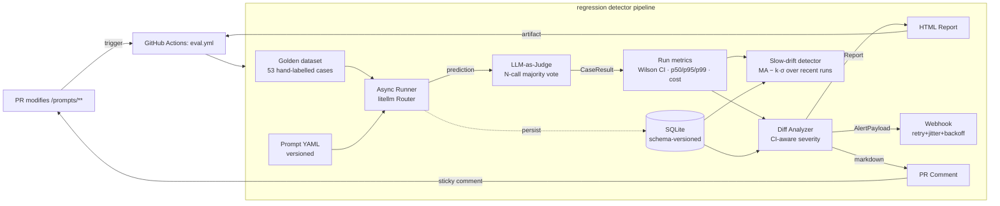
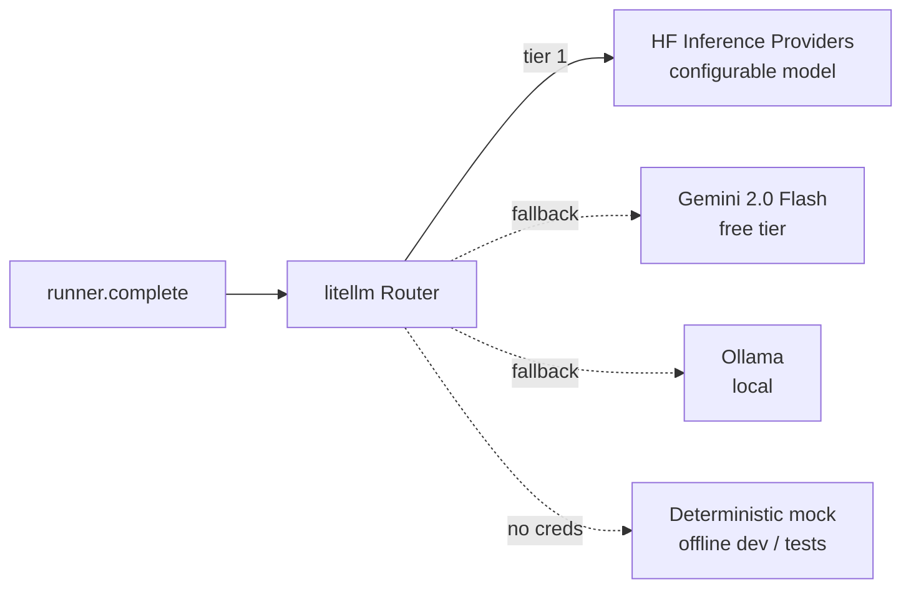
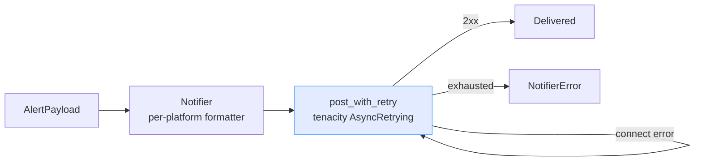

# Architecture

## High-level pipeline

## Provider fallback chain (LLM Router)

The Router tries providers in declared order and retries within each. Every
model id is configurable via `Settings` (`LRD_HF_MODEL`, `LRD_GEMINI_MODEL`,
`LRD_OLLAMA_MODEL`) — there are no hardcoded provider models. The full chain
costs $0 — every default provider has a free tier or runs locally.

## Webhook delivery

3 attempts · `wait_exponential_jitter(initial=0.5s, max=2.0s, jitter=0.25)`
· retries on 408/425/429/5xx and `httpx.HTTPError`. Jitter avoids thundering-herd
collisions when multiple processes retry the same webhook.

## Module boundaries

| Module | Responsibility | Key types |
|---|---|---|
| `config` | env-driven settings, model + cost overrides, platform detection | `Settings`, `WebhookPlatform`, `LogLevel` |
| `llm.client` | provider-agnostic completion via litellm Router | `LLMClient`, `LLMResponse`, `RouterClient` |
| `llm.mock` | deterministic in-process LLM stub | `MockLLMClient` |
| `eval.dataset` | typed data + YAML/JSON loaders | `GoldenCase`, `PromptSpec`, `EvalRun`, `RunSummary`, `CategoryAccuracy` |
| `eval.runner` | async batched orchestration; computes CI / percentiles / cost / per-category | `Runner` |
| `eval.scorer` | LLM-as-Judge with optional N-call majority vote | `Judge`, `JudgeScore` |
| `eval.parsing` | tolerant JSON extraction from model output | `extract_json_object` |
| `eval.stats` | Wilson 95% CI · percentiles · slow-drift detection (pure, dependency-free) | `WilsonInterval`, `DriftSignal`, `wilson_interval`, `percentile`, `detect_slow_drift` |
| `diff.analyzer` | CI-aware regression detection + severity logic | `Analyzer`, `DiffReport`, `Thresholds` |
| `diff.drift` | slow-drift wrapper over `EvalRun` history | `DriftReport`, `analyse_drift` |
| `notify.base` | Notifier Protocol + shared payload model | `Notifier`, `AlertPayload`, `NullNotifier` |
| `notify.transport` | shared HTTP retry/backoff/jitter policy | `post_with_retry` |
| `notify.{slack,google_chat,discord,generic}` | per-platform format + delivery | `SlackNotifier` etc. |
| `storage.sqlite` | run history + schema-versioned forward migration | `SQLiteStorage` |
| `report.html` | Jinja2-driven HTML report renderer | `render_html`, `write_html` |
| `report.pr_comment` | GitHub-flavoured markdown summary | `render_pr_comment` |
| `dashboard.app` | Streamlit dashboard (timeline, CI band, drift, side-by-side) | — |
| `cli` | typer entry point | `lrd run`, `lrd diff`, `lrd report`, `lrd dashboard` |

## Why these choices

- **`litellm` Router** — one wire format (OpenAI chat) for 100+ models. Adding a provider is one branch in `_build_router`. Model IDs come from `Settings`, never hardcoded.
- **Wilson 95% confidence intervals** — eval datasets are small; the normal-approximation interval breaks at small N. Wilson is the textbook choice and fits in 30 lines of stdlib `math` (no `scipy` needed). Severity is downgraded when intervals overlap so the system doesn't fire false alarms.
- **N-call majority-vote judging** — single-call LLM-as-Judge is noisy; majority vote at 3× cost dampens variance materially. Configurable via `LRD_JUDGE_CONSENSUS_N` so cost-minimal runs and production-grade alerts share the same code path.
- **Slow-drift detector** — PR-level diffs catch sudden regressions; an `MA − k·σ` band over recent runs catches the slow tightening that one-shot diffs miss.
- **`tenacity` with jittered exponential backoff** — webhook delivery must survive transient 5xx; jitter avoids thundering-herd retry collisions. Centralised in `notify.transport` so every platform uses identical policy.
- **Pydantic v2 with `frozen=True, extra="forbid"`** — runtime validation doubles as documentation; serialisation for SQLite is `model_dump_json`. Strict-by-default.
- **Schema-versioned SQLite** — `eval_runs` rows are tagged with `schema_version`; `_migrate_payload` forward-fills new fields with sensible defaults so old rows survive non-additive changes.
- **Protocols over ABCs** for `Notifier` and `LLMClient` — duck-typed, no inheritance, trivial to test with `NullNotifier` / `MockLLMClient`.
- **Mock provider in `llm.mock`** — the full pipeline runs offline with no keys, which is what makes the 79-test suite hermetic, the dev loop free, and the demo runnable in 3 seconds.
